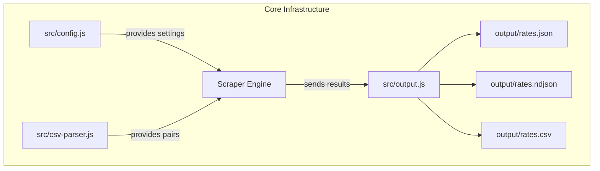

# Core Infrastructure

## Overview

Set up the Node.js project foundation: package.json, dependencies, configuration module with currency-to-country mapping, CSV parser for Provider.csv, and output writer for results.

## Language Stack

| Language | Purpose | Skill Location |
|----------|---------|----------------|
| JavaScript (Node.js) | All implementation | `.agents/skills/javascript-clean-code/skill.md` |

## Requirements

1. **Project Setup**
   - package.json with name `rates-fetcher`, main `src/index.js`
   - Dependencies: `playwright`, `csv-parse`
   - Scripts: `start`, `scrape`, `test`, `test-provider`
   - .gitignore for node_modules, output, logs, .env

2. **Configuration Module** (`src/config.js`)
   - Default send amount: 1000
   - Currency-to-country mapping (14 currencies → country code, name, slug)
   - Browser launch options (headless, no-sandbox, disable automation detection)
   - Browser context options (realistic user-agent, viewport 600x1000, locale en-US)
   - Timeout settings (navigation: 30s, element: 15s, between requests: 2s)

3. **CSV Parser** (`src/csv-parser.js`)
   - Read Provider.csv using `csv-parse/sync`
   - Parse columns: provider_name, provider_url, send_currency, receive_currency, currency_pair
   - Group rows by provider_name into `{ name, url, pairs: [{ sendCurrency, receiveCurrency }] }`
   - Return object keyed by provider name

4. **Output Writer** (`src/output.js`)
   - `writeResults(results)` — write final summary to `output/rates.json` (pretty-printed)
   - `writeResults(results)` — write final CSV to `output/rates.csv` with headers
   - `appendResults(results)` — incremental NDJSON append to `output/rates.ndjson`, CSV append to `output/rates.csv`
   - `saveErrorScreenshot(page, provider, from, to)` — capture failure screenshot to `output/errors/`
   - Create output directory structure if it doesn't exist
   - Each result row: provider, sendCurrency, receiveCurrency, sendAmount, exchangeRate, receiveAmount, fee, timestamp, success, error

## Architecture



### File Structure

```
rates-fetcher/
├── package.json
├── .gitignore
├── Provider.csv
├── src/
│   ├── index.js          # Entry point
│   ├── config.js          # Configuration & constants
│   ├── csv-parser.js      # CSV reader & grouper
│   └── output.js          # Result writer (JSON + CSV)
└── output/                # Generated at runtime
    ├── rates.json
    └── rates.csv
```

### Component Details

1. **config.js**
   - **Purpose**: Centralized configuration for the entire scraper
   - **Exports**: `SEND_AMOUNT`, `CURRENCY_COUNTRY_MAP`, `BROWSER_OPTIONS`, `CONTEXT_OPTIONS`, `TIMEOUTS`
   - **Currency Map**: Maps currency codes to `{ code, name, slug }` for URL construction

2. **csv-parser.js**
   - **Purpose**: Parse Provider.csv and group by provider
   - **Exports**: `loadProviderPairs(csvPath)` → `{ [providerName]: { name, url, pairs } }`
   - **Dependencies**: `csv-parse/sync`, `fs`, `path`

3. **output.js**
   - **Purpose**: Write scraping results to files (final + incremental)
   - **Exports**: `writeResults(results)`, `appendResults(results)`, `saveErrorScreenshot(page, provider, from, to)`
   - **Dependencies**: `fs`, `path`

### Output Schema

```javascript
{
  provider: "Wise",
  sendCurrency: "USD",
  receiveCurrency: "NGN",
  sendAmount: 1000,
  exchangeRate: 1580.50,
  receiveAmount: 1580500,
  fee: 5.00,
  timestamp: "2026-04-25T12:00:00.000Z"
}
```

## Tasks

- [ ] Task 1: Create/verify package.json with correct fields, scripts, and dependencies
- [ ] Task 2: Create .gitignore with node_modules, output, logs, .env
- [ ] Task 3: Implement `src/config.js` with all constants and mappings
- [ ] Task 4: Implement `src/csv-parser.js` with `loadProviderPairs()` function
- [ ] Task 5: Implement `src/output.js` with `writeResults()` function
- [ ] Task 6: Verify CSV parser correctly groups all 423 rows into 11 providers
- [ ] Task 7: Verify output writer creates valid JSON and CSV files
- [ ] Task 8: Install Playwright Chromium browser (`npx playwright install chromium`)

## Testing

### Test Cases

1. **CSV Parser — correct grouping**
   - Given: Provider.csv with 423 rows
   - When: `loadProviderPairs('Provider.csv')` is called
   - Then: Returns object with 11 keys, Wise has 49 pairs, TransferGo has 5 pairs

2. **CSV Parser — pair structure**
   - Given: Provider.csv
   - When: parsed
   - Then: Each pair has `sendCurrency` and `receiveCurrency` as 3-letter codes

3. **Output Writer — JSON**
   - Given: Array of result objects
   - When: `writeResults(results)` is called
   - Then: `output/rates.json` exists and is valid JSON

4. **Output Writer — CSV**
   - Given: Array of result objects
   - When: `writeResults(results)` is called
   - Then: `output/rates.csv` exists with correct headers and rows

5. **Config — currency map completeness**
   - Given: `CURRENCY_COUNTRY_MAP`
   - When: checked
   - Then: Contains all 14 currencies (7 send + 7 receive)

## Success Criteria

- [ ] All tasks completed
- [ ] All tests passing
- [ ] CSV parser handles the real Provider.csv correctly
- [ ] Output writer produces valid, readable files

---

_Created: 2026-04-25_
