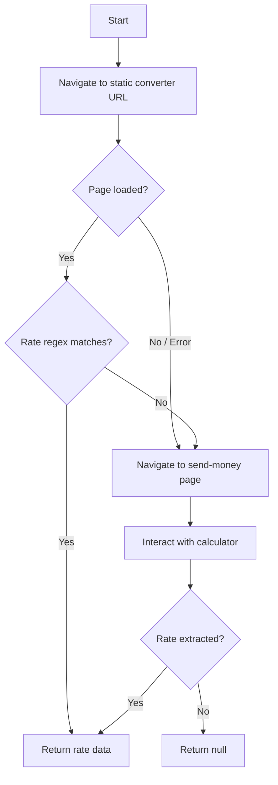

# Wise Provider

## Overview

Wise (formerly TransferWise) is a major remittance provider with 49 currency pairs in Provider.csv. They offer both a static currency converter page and an interactive send-money page. The scraper tries the static page first, falling back to the interactive page.

## Provider Details

- **Name**: Wise
- **Base URL**: https://wise.com
- **Pairs in CSV**: 49 (7 send currencies × 7 receive currencies)
- **Send currencies**: AED, AUD, CAD, EUR, GBP, PLN, USD
- **Receive currencies**: GHS, INR, KES, MXN, NGN, PHP, PKR

## Scraping Strategy

### Priority 1: Static Currency Converter Page

**URL Pattern**: `https://wise.com/gb/currency-converter/{from}-to-{to}-rate?amount={sendAmount}`

- `{from}`: lowercase send currency (e.g., `usd`)
- `{to}`: lowercase receive currency (e.g., `ngn`)
- `{sendAmount}`: numeric amount (default: 1000)

**Example**: `https://wise.com/gb/currency-converter/usd-to-ngn-rate?amount=1000`

**Page Structure**:
- Displays mid-market exchange rate
- Shows "1 USD = X NGN" format text
- Contains amount conversion result
- Includes historical rate chart (48H, 1W, 1M, 6M, 12M, 5Y)

**Extraction Approach**:
1. Navigate to URL, wait for DOM content loaded + 3s
2. Get full body text
3. Regex match: `1\s+{FROM}\s*=\s*([\d.,]+)\s*{TO}` (case insensitive)
4. Parse matched number (remove commas) as exchange rate
5. Calculate receiveAmount = exchangeRate × sendAmount

### Priority 2: Interactive Send Money Page (Fallback)

**URL**: `https://wise.com/gb/send-money/`

**Page Structure**:
- Interactive calculator with send/receive amount fields
- Currency selector dropdowns with flag icons
- Real-time rate calculation
- Fee display

**Interaction Flow**:
1. Navigate to `https://wise.com/gb/send-money/`
2. Wait for calculator to load (wait for input fields)
3. Dismiss cookie consent if present
4. Find "You send" amount input → clear and fill with sendAmount
5. Find send currency selector → click and select sendCurrency
6. Find receive currency selector → click and select receiveCurrency
7. Wait for rate to recalculate (2-3s or wait for network idle)
8. Extract rate from the displayed "1 FROM = X TO" text
9. Extract receive amount from "They receive" field
10. Extract fee from fee display if visible

**Selectors to Try** (in order of resilience):
- Amount input: `input[type="text"]` near "You send" text, or `page.getByLabel('You send')`
- Currency dropdowns: buttons/selectors adjacent to amount fields
- Rate display: text matching `1 {FROM} = {rate} {TO}` pattern
- Fee: text near "Fee" or "Transfer fee" label

### Decision Flow



## Architecture

### File Structure

```
src/providers/wise.js
```

### Component Details

- **Module**: `src/providers/wise.js`
- **Exports**: `{ name: 'Wise', fetchRate(page, sendCurrency, receiveCurrency, sendAmount) }`
- **Dependencies**: `../config` (TIMEOUTS)
- **Strategy**: Static URL first → regex extraction → interactive fallback if needed

### Rate Extraction Patterns

Primary regex: `1\s+{SEND}\s*=\s*([\d.,]+)\s*{RECV}` (case insensitive)

Fallback regex: `([\d.,]+)\s*{RECV}` (less specific, matches any amount in receive currency)

### Cookie/Consent Handling

Wise may show a cookie consent banner. Dismiss with:
- Look for button with text "Accept" or "Got it"
- Or look for `[data-testid="cookie-accept"]`
- Catch and ignore if not present

### Anti-Bot Considerations

- Wise generally allows headless browsing for their public converter pages
- The send-money page may be more restrictive
- Use realistic user-agent and viewport from config
- Add reasonable wait times between interactions

## Tasks

- [ ] Task 1: Implement static converter URL navigation and rate extraction
- [ ] Task 2: Implement regex-based rate parsing from page body text
- [ ] Task 3: Implement interactive send-money page fallback
- [ ] Task 4: Add cookie consent dismissal
- [ ] Task 5: Test with multiple currency pairs (USD→NGN, GBP→INR, EUR→PHP)
- [ ] Task 6: Handle edge cases (unsupported pair, timeout, rate not found)

## Testing

### Test Cases

1. **Static page — rate extraction**
   - Given: Navigate to `wise.com/gb/currency-converter/usd-to-ngn-rate?amount=1000`
   - When: `fetchRate(page, 'USD', 'NGN', 1000)` called
   - Then: Returns `{ exchangeRate: <number>, receiveAmount: <number>, fee: null }`

2. **Rate regex — standard format**
   - Given: Body text contains "1 USD = 1,580.50 NGN"
   - When: Regex applied
   - Then: Extracts 1580.50

3. **Rate regex — no commas**
   - Given: Body text contains "1 GBP = 85.23 INR"
   - When: Regex applied
   - Then: Extracts 85.23

4. **Fallback — static fails**
   - Given: Static page returns no rate match
   - When: `fetchRate` falls through to interactive
   - Then: Attempts send-money page and extracts rate

5. **Edge case — unsupported pair**
   - Given: A currency pair Wise doesn't support
   - When: `fetchRate` called
   - Then: Returns `{ exchangeRate: null, receiveAmount: null, fee: null }`

## Success Criteria

- [ ] All tasks completed
- [ ] Static converter extraction works for at least 5 different pairs
- [ ] Interactive fallback triggers and works when static fails
- [ ] No unhandled errors for any of the 49 pairs

---

_Created: 2026-04-25_
