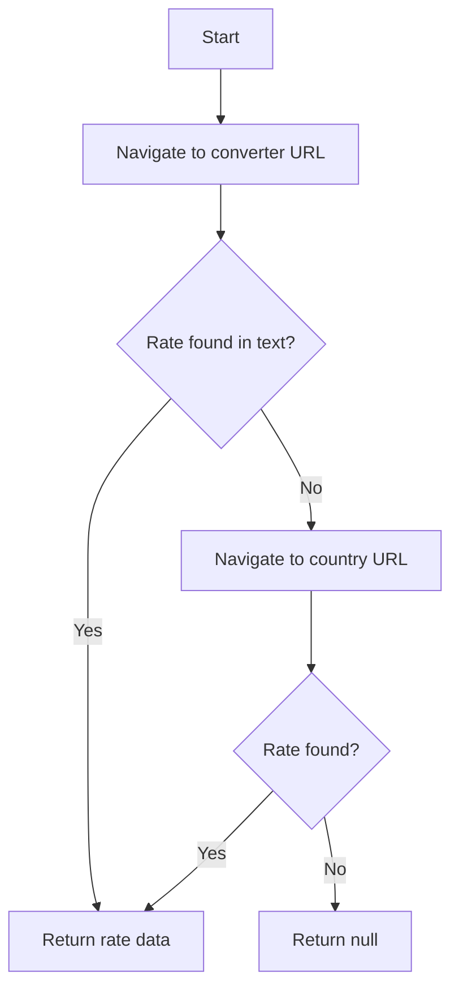

# Remitly Provider

## Overview

Remitly is a major digital remittance provider with 49 currency pairs. They have two URL patterns: a static currency converter page and a country-based pricing page with an interactive calculator.

## Provider Details

- **Name**: Remitly
- **Base URL**: https://www.remitly.com
- **Pairs in CSV**: 49
- **Send currencies**: AED, AUD, CAD, EUR, GBP, PLN, USD
- **Receive currencies**: GHS, INR, KES, MXN, NGN, PHP, PKR

## Scraping Strategy

### Priority 1: Static Currency Converter Page

**URL Pattern**: `https://www.remitly.com/us/en/currency-converter/{from}-to-{to}-rate`

- `{from}`: lowercase send currency (e.g., `usd`)
- `{to}`: lowercase receive currency (e.g., `ngn`)

**Example**: `https://www.remitly.com/us/en/currency-converter/usd-to-ngn-rate`

**Page Structure**:
- Shows exchange rate for the pair
- May display "1 USD = X NGN" text
- Links to popular currency pairs
- FAQ section about exchange rates

**Extraction Approach**:
1. Navigate to URL, wait for content + 3s
2. Get body text
3. Regex match: `1\s+{FROM}\s*=\s*([\d.,]+)\s*{TO}`
4. Parse rate and calculate receiveAmount

### Priority 2: Country-Based Pricing Page (Fallback)

**URL Pattern**: `https://www.remitly.com/{fromCountryCode}/en/{toCountrySlug}`

- `{fromCountryCode}`: lowercase 2-letter country code (from CURRENCY_COUNTRY_MAP, e.g., `us`)
- `{toCountrySlug}`: lowercase country slug (e.g., `nigeria`)

**Example**: `https://www.remitly.com/us/en/nigeria`

**Page Structure**:
- Transfer calculator form
- "Sending from" country pre-populated
- "Sending to" dropdown
- Shows pricing details, delivery time, total cost
- Interactive calculator may show exchange rate

**Interaction Flow**:
1. Navigate to country URL
2. Wait for page load + 3s
3. Look for rate display text
4. If not visible, interact with calculator form
5. Extract rate from "1 FROM = X TO" text or from amount fields

### Decision Flow



## Architecture

### File Structure

```
src/providers/remitly.js
```

### Component Details

- **Module**: `src/providers/remitly.js`
- **Exports**: `{ name: 'Remitly', fetchRate(page, sendCurrency, receiveCurrency, sendAmount) }`
- **Dependencies**: `../config` (TIMEOUTS, CURRENCY_COUNTRY_MAP)
- **Strategy**: Static converter URL → country-based URL fallback

### URL Construction

The country-based URL requires mapping currencies to countries:
- `sendCurrency` → `CURRENCY_COUNTRY_MAP[sendCurrency].code` (lowercase) for the `/{country}/` segment
- `receiveCurrency` → `CURRENCY_COUNTRY_MAP[receiveCurrency].slug` for the `/{country}` segment

### Cookie/Consent Handling

- Remitly may show cookie consent or location-based redirects
- Dismiss any overlay before interacting with calculator
- Some geo-redirects may change the URL — check for this

### Anti-Bot Considerations

- Remitly's static converter pages are generally accessible
- Country-based pages may require more realistic browsing behavior
- Avoid rapid successive requests to the same page

## Tasks

- [ ] Task 1: Implement static converter URL construction and navigation
- [ ] Task 2: Implement regex-based rate extraction from converter page
- [ ] Task 3: Implement country-based URL construction using CURRENCY_COUNTRY_MAP
- [ ] Task 4: Implement country page fallback with rate extraction
- [ ] Task 5: Test with multiple pairs (USD→NGN, GBP→INR, EUR→MXN)
- [ ] Task 6: Handle edge cases (geo-redirect, unsupported pair, page not found)

## Testing

### Test Cases

1. **Static converter — rate found**
   - Given: `remitly.com/us/en/currency-converter/usd-to-ngn-rate`
   - When: `fetchRate(page, 'USD', 'NGN', 1000)`
   - Then: Returns valid exchangeRate

2. **Country URL construction**
   - Given: sendCurrency=USD, receiveCurrency=NGN
   - When: URL constructed
   - Then: `https://www.remitly.com/us/en/nigeria`

3. **Fallback — static fails, country works**
   - Given: Static page has no rate match
   - When: Falls through to country page
   - Then: Extracts rate from country page

4. **Edge case — EUR send currency**
   - Given: EUR maps to DE (Germany)
   - When: Country URL for EUR→GHS
   - Then: `https://www.remitly.com/de/en/ghana`

## Success Criteria

- [ ] All tasks completed
- [ ] Static extraction works for common pairs
- [ ] Country URL fallback works
- [ ] No crashes on any of the 49 pairs

---

_Created: 2026-04-25_
