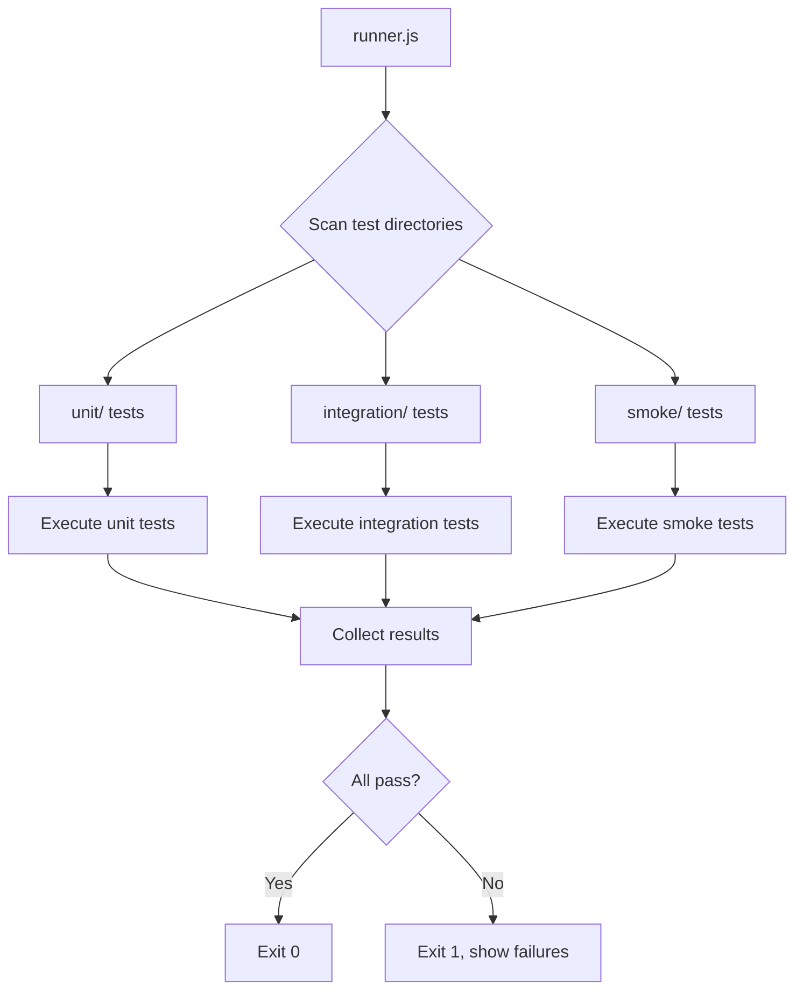

# Testing

## Overview

Comprehensive test suite covering unit tests for infrastructure modules, integration tests for the scraper engine, and smoke tests for individual providers. Uses Node.js assert module with a simple test runner.

## Requirements

1. **Test Runner** (`tests/runner.js`)
   - Simple test runner that discovers and executes test files
   - Supports async/await tests
   - Reports pass/fail with detailed messages
   - Exit code 0 on all pass, 1 on any failure
   - `npm test` runs the test runner

2. **Unit Tests**
   - `tests/unit/test-csv-parser.js` — CSV parsing and grouping
   - `tests/unit/test-config.js` — Configuration constants and mappings
   - `tests/unit/test-output.js` — Output writer (JSON + CSV)
   - `tests/unit/test-registry.js` — Provider registry

3. **Integration Tests**
   - `tests/integration/test-scraper-engine.js` — Full engine with mock providers
   - `tests/integration/test-retry-logic.js` — Retry behavior on failure
   - `tests/integration/test-error-isolation.js` — One provider failing doesn't stop others
   - `tests/integration/test-result-collection.js` — Results accumulated correctly

4. **Provider Smoke Tests**
   - `tests/smoke/test-providers.js` — Test one pair per provider (quick sanity check)
   - `tests/smoke/` directory for individual provider smoke tests
   - Each smoke test launches browser, tests one pair, reports result
   - `npm run test-provider` runs a single provider smoke test

5. **Test Utilities** (`tests/utils.js`)
   - Mock provider factory for testing engine without real browsers
   - Test fixture data (sample currency pairs, mock rates)
   - Helper to create test browser contexts (for integration tests)

## Architecture

### File Structure

```
tests/
├── runner.js              # Test discovery and execution
├── utils.js               # Shared test utilities
├── unit/
│   ├── test-csv-parser.js
│   ├── test-config.js
│   ├── test-output.js
│   └── test-registry.js
├── integration/
│   ├── test-scraper-engine.js
│   ├── test-retry-logic.js
│   ├── test-error-isolation.js
│   └── test-result-collection.js
└── smoke/
    ├── test-providers.js
    └── README.md           # How to run smoke tests
```

### Test Runner Flow



### Test Interface for Providers

```javascript
// Mock provider for testing engine
const mockProvider = {
  name: 'MockProvider',
  async fetchRate(page, sendCurrency, receiveCurrency, sendAmount) {
    if (sendCurrency === 'FAIL') {
      throw new Error('Simulated failure');
    }
    return {
      exchangeRate: 100,
      receiveAmount: 100 * sendAmount,
      fee: 5,
    };
  },
};
```

## Tasks

- [ ] Task 1: Create `tests/runner.js` — test discovery and execution
- [ ] Task 2: Create `tests/utils.js` — shared test utilities and mock providers
- [ ] Task 3: Write CSV parser unit tests
- [ ] Task 4: Write config unit tests
- [ ] Task 5: Write output writer unit tests
- [ ] Task 6: Write scraper engine integration tests
- [ ] Task 7: Write retry logic integration tests
- [ ] Task 8: Write provider smoke test for one pair per provider

## Testing

### Test Cases

1. **Test runner — discovers all tests**
   - Given: Test files in unit/, integration/, smoke/
   - When: `npm test` runs
   - Then: All test files are discovered and executed

2. **CSV parser — correct grouping**
   - Given: Real Provider.csv
   - When: `loadProviderPairs()` called
   - Then: 11 providers, correct pair counts

3. **Config — complete currency map**
   - Given: CURRENCY_COUNTRY_MAP
   - When: checked
   - Then: All 14 currencies present with code, name, slug

4. **Engine — retry logic**
   - Given: Mock provider that fails once then succeeds
   - When: Engine processes pairs
   - Then: Result is successful (retry worked)

5. **Engine — error isolation**
   - Given: Provider A always fails, Provider B always succeeds
   - When: Engine processes both
   - Then: Provider A has null results, Provider B has valid results

6. **Output — valid JSON**
   - Given: Results array
   - When: `writeResults()` called
   - Then: `output/rates.json` parses as valid JSON

7. **Smoke test — single provider**
   - Given: `node src/test-provider.js Wise USD NGN`
   - When: Command runs
   - Then: Prints rate data or clear error message

## Success Criteria

- [ ] All tasks completed
- [ ] `npm test` passes with all tests green
- [ ] At least one smoke test per provider runs successfully
- [ ] Test runner exits with correct code (0/1)

---

_Created: 2026-04-25_
